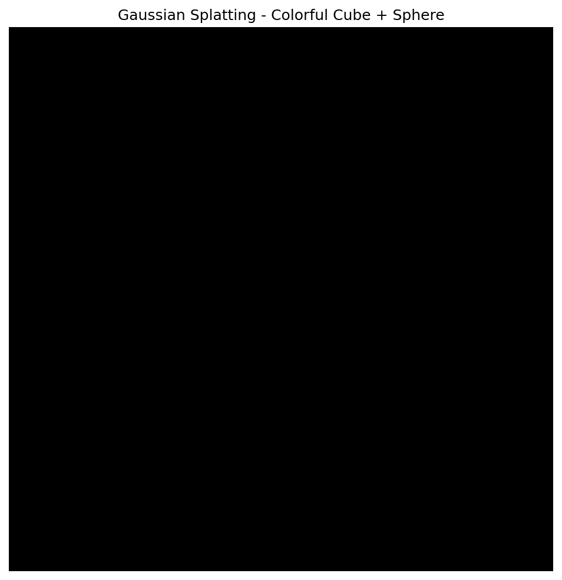
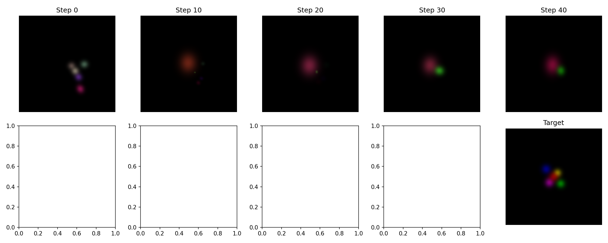

# Gaussian Splatting Study

3D Gaussian Splatting 연구 및 실험 기록 레포지토리

## Overview

이 프로젝트는 3D Gaussian Splatting을 사용하여 radiance field 렌더링을 실험하는 것입니다.

## 설치 및 실행 과정

### 1. 환경 설정
- Python 3.10
- PyTorch 2.0.1 + CUDA 11.8
- gsplat 1.5.2 (NVIDIA 개발的高속 rasterization 라이브러리)
- COLMAP 3.13.0 (Structure-from-Motion)

### 2. 설치 명령어
```bash
# PyTorch 설치
pip install torch==2.0.1+cu118 torchvision==0.15.2+cu118 --extra-index-url https://download.pytorch.org/whl/cu118

# gsplat 설치 (precompiled wheel)
pip install gsplat==1.5.2+pt20cu118 --extra-index-url https://docs.gsplat.studio/whl

# COLMAP 설치 (Windows)
# https://sourceforge.net/projects/colmap.mirror/files/ 에서 다운로드
```

### 3. 실행

#### 기본 렌더링 테스트
```bash
python test_gsplat.py
```

#### 학습 데모 (타겟 이미지 수렴)
```bash
python train_simple.py
```

## 결과

### 렌더링 테스트 결과


### 학습 결과 (50 steps)


위 이미지는:
- **위 행**: 학습 진행 (Step 0 → 40)
- **오른쪽 아래**: 타겟 이미지 (5개의 색상 점이 원)

## 프로젝트 구조

```
gaussian_splatting/
├── test_gsplat.py       # 기본 렌더링 테스트
├── train_simple.py       # 학습 데모
├── result.png            # 큐브+구 렌더링 결과
├── training_result.png   # 학습 과정 결과
├── datasets/             # 데이터셋
└── README.md            # 이 파일
```

## 사용된 라이브러리

- **gsplat**: NVIDIA 개발, differentiable Gaussian rasterization
- **PyTorch**: 딥러닝 프레임워크
- **COLMAP**: Structure-from-Motion (이미지 → 3D 포인트클라우드)
- **Matplotlib**: 결과 시각화

## Reference

- [3D Gaussian Splatting for Real-Time Radiance Field Rendering](https://repo-sam.inria.fr/fungraph/3d-gaussian-splatting/)
- [gsplat repository](https://github.com/gaussiansplatting/gsplat)
- [Nerfstudio](https://docs.nerf.studio/)
